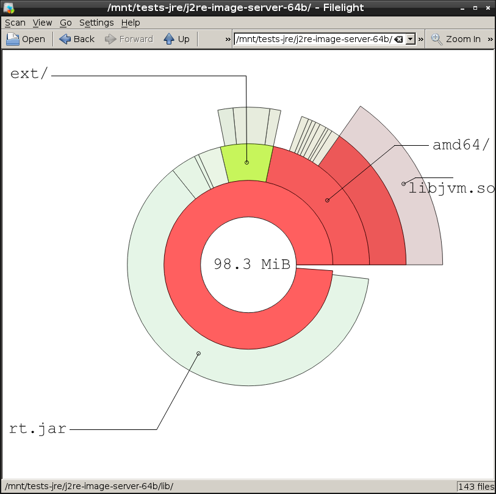
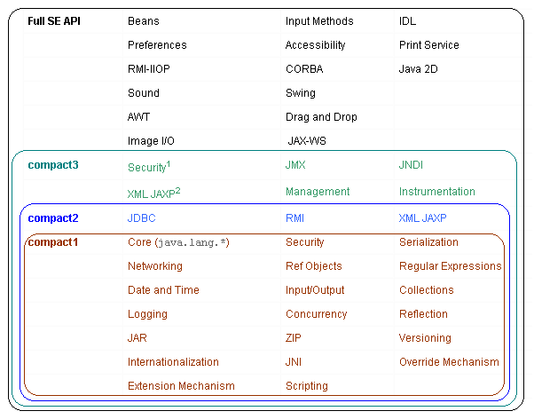
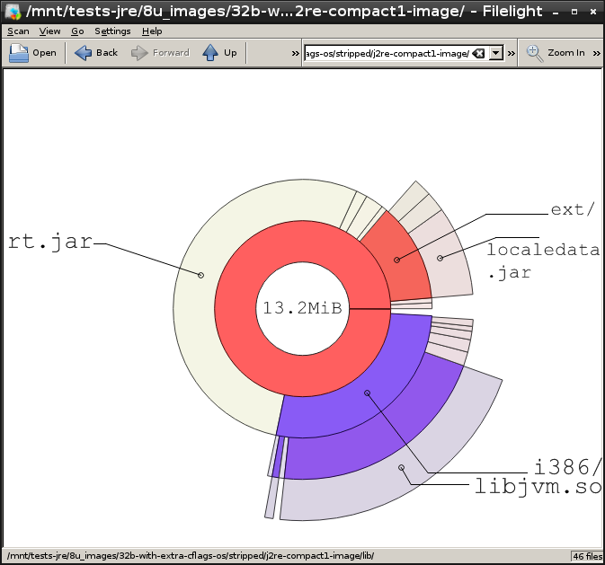
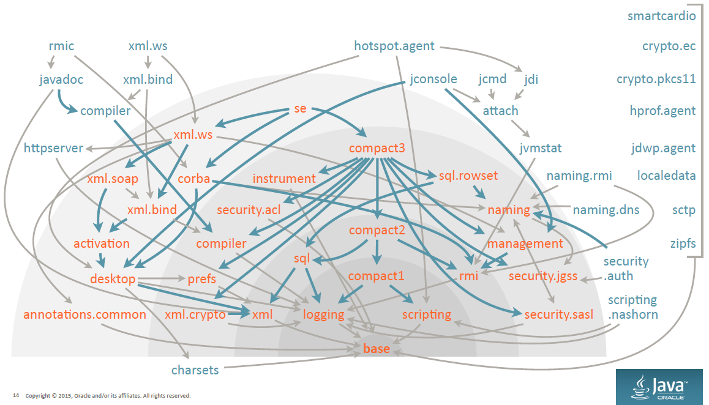

include::_settings_reveal.adoc[]
:lang: en

== How to compile OpenJDK 8 for embedded devices

Thomas Lorblanchès

16/10/2015

[cols="^,^",width="100%",frame="none",grid="none"]
|====================
^a| image::resources/big_coffee.jpg[width=300, height=300] ^a| image::resources/little_coffee.jpg[width=300, height=300]
|====================

== Setup (Debian and derivatives)

[source]
----
$ sudo apt-get install mercurial // <1>
$ hg clone http://hg.openjdk.java.net/jdk8u/jdk8u60 <2>
$ cd jdk8u60
$ bash ./get_source.sh <3>
$ sudo apt-get install openjdk8-jdk <4>
$ sudo apt-get build-dep openjdk-8 <5>
----
<1> OpenJDK uses Mercurial for its source repositories
<2> Download root repository
<3> Download sub-repositories ("forest")
<4> Java 7 or 8 is required to compile OpenJDK 8
<5> Installation of build dependencies

== Compilation of OpenJDK 8

* Configuration:

[source]
----
$ bash ./configure --with-jvm-variants=server \
                   --with-debug-level=release \
                   --disable-debug-symbols --disable-zip-debug-info \
                   --enable-unlimited-crypto
----

* Help on configuration options:

[source]
----
$ bash ./configure --help
----

* Compilation:

[source]
----
$ make all
----

== Initial assessment: 98.3Mo

== VM flavours

Server:: default VM, best performances, biggest size.
Client:: 32bit VM optimised for client applications (startup time).
Minimal:: http://openjdk.java.net/jeps/148[JEP-148], 32bit VM, minimum footprint, perf. degradation < 5%.
Kernel:: ancestor of Minimal (Java 6), Windows only, not maintained.
Zero:: VM without assembly code, interpreter only.
Zero-Shark:: Zero VM with JIT compiler based on LLVM.

== Default sizes and performances of x86 VM

[cols="1,2a,^1,^1",width="100%",options="header"]
|====================
| VM | Configuration option +
`--with-jvm-variants=` | Size of libjvm.so | SPECjvm2008 score
| Server 64bits | `server` | 15.5Mo | 70.9 ops/m
| Server 32bits | `server` | 13.5Mo | 62.9 ops/m
| Client 32bits | `client` | 8.4Mo | 43.9 ops/m
| Minimal 32bits | `minimal1` | 5.8Mo | 40.4 ops/m
| Zero 32 bits | `zero` | 7.0Mo | 1.4 ops/m
| Shark 32 bits | `zeroshark` | 19.8Mo | 16.8 ops/m
|====================

== libjvm.so optimisation

[%step]
* Dynamic linking with C++ lib of the OS:
** `--with-stdc++lib=dynamic`
** Saving: -102ko
* Compilation optimised for size:
** `--with-extra-cflags=-Os`
** Saving: -1.8Mo on libjvm.so (VM Minimal)
* Stripping of binaries:
** `find . -exec strip --strip-unneeded {} \;`
** Saving: -1Mo on libjvm.so (VM Minimal)

== Summary of the size optimisations of libjvm.so

[cols="1,^1,^1",width="100%",options="header"]
|====================
| VM | Default size of libjvm.so | "Optimised" size
| Server 64bits | 15.5Mo | 8.8Mo
| Server 32bits | 13.5Mo | 7.1Mo
| Client 32bits | 8.4Mo | 4.1Mo
| Minimal 32bits | 5.8Mo | 2.8Mo
| Zero 32 bits | 7.0Mo | 3.4Mo
| Shark 32 bits | 19.8Mo | 14.5Mo
|====================

== Security

[cols=".^1a,.^2a",width="100%",frame="none",grid="none"]
|====================
| image::resources/debian.png[width=200] | Use of Debian hardening flags +
(cf. https://wiki.debian.org/Hardening).
|====================

`--with-extra-cflags='-Os -D_FORTIFY_SOURCE=2` +
`-fstack-protector-strong'`

`--with-extra-ldflags='-Xlinker -z -Xlinker relro'`

[cols=".^4a,.^1a",width="100%",frame="none",grid="none"]
|====================
| Cost: +139ko (VM Minimal) without any measurable performance impact | image::resources/duke_wall.png[height=200]
|====================

== What about ARM?

* ARMv8 (64 bits) :
** AArch64 port since March 2014
** Repository: http://hg.openjdk.java.net/aarch64-port/jdk8
** Merged inside jdk9 repository
* ARMv6/7 (32 bits) :
** Zero / Shark
** Oracle Java SE Embedded 8 (proprietary license) : http://www.oracle.com/technetwork/java/embedded/embedded-se/

== Optimisation of rt.jar: compact profiles

New in Java 8.

[quote, Mark Reinhold]
Compact profiles are sort of a poor man's module system.

== Generation of compact profiles

[source]
----
$ make profiles
----

[width="50%",options="header"]
|====================
| Type of JRE | Size of rt.jar
| Full JRE | 61.7Mo
| Compact 3 | 30.5Mo
| Compact 2 | 24.8Mo
| Compact 1 | 13.9Mo
|====================

== Compression of rt.jar

* By default, rt.jar is not compressed!
[source]
----
$ zipinfo images/j2re-compact1-image/lib/rt.jar
[...]
4689 files, 13858994 bytes uncompressed, 13858994 bytes compressed: 0.0%
----
* Compile with `COMPRESS_JARS=true` :
[source]
----
$ make all COMPRESS_JARS=true
$ make profiles COMPRESS_JARS=true
----
[source]
----
$ zipinfo images/j2re-compact1-image/lib/rt.jar
[...]
4689 files, 13858994 bytes uncompressed, 6574887 bytes compressed: 52.6%
----

== Compressed rt.jar sizes

[width="70%",options="header"]
|====================
| Type of JRE | Without compression | With compression
| Full JRE | 61.7Mo | 30.1Mo
| Compact 3 | 30.5Mo | 14.9Mo
| Compact 2 | 24.8Mo | 12.0Mo
| Compact 1 | 13.9Mo | 7.1Mo
|====================

Drawback: class loading time / application startup time

== Where are we now?

Minimal VM with compact 1 profile and compression.

== The final bits

* lib/ext (1.6Mo): optional packages
** localedata.jar (1.1Mo): local data for java.text and java.util (43 languages!)
** sunec.jar (35ko) + lib/{arch}/libsunec.so (180ko): elliptic curve crypto
** sunjce_provider.jar (253ko) + lib/jce.jar (91ko) : (a)symmetric crypto (Impl+API)
** sunpkcs11.jar (230ko) + lib/{arch}/libj2pkcs11.so (63ko): PKCS#11 (crypto tokens)
* lib/jsse.jar (303ko): Java Secure Socket Extension (TLS/SSL)

== What about Java 9?
55 modules!

== New tools

* jdeps (since Java 8): dependency analysis.

[source]
----
$ jdeps -profile helloworld.jar
helloworld.jar -> java.base (compact1)
   test (helloworld.jar)
      -> java.io                                            compact1
      -> java.lang                                          compact1
----

* jlink (Java 9): creaton of custom JVM images.

== Questions ?

image::resources/duke.png[]

