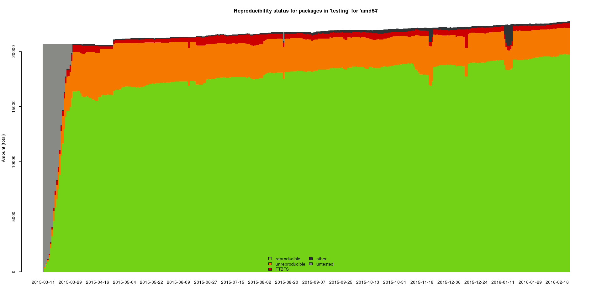
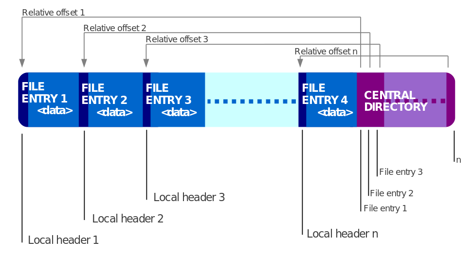

include::_settings_reveal.adoc[]
:lang: fr

[data-background="./resources/gears.jpg"]
== Des compilations VRAIMENT reproductibles avec Maven

Thomas Lorblanchès

21/04/2016

== Maven, reproductible ?

image::resources/maven.png[width=600]

[%step]
* Toutes les versions des plugins spécifiées dans le pom
* Aucune dépendance SNAPSHOT
* Utilisation de maven-enforcer-plugin (règles requirePluginVersions et requireReleaseVersion)
* Et pourtant...

== Hello non-reproducible world!

[source]
----
$ cd HelloWorld
$ mvn clean install
...
[INFO] Downloading the Internet...
[INFO] Running tons of plugins...
...
[INFO] BUILD SUCCESS

$ sha256sum target/hello-1.0-SNAPSHOT.jar 
87de0b[...]7ca9  target/hello-1.0-SNAPSHOT.jar
----

[source]
----
$ mvn clean install
...
[INFO] BUILD SUCCESS

$ sha256sum target/hello-1.0-SNAPSHOT.jar 
2f3167[...]86ab  target/hello-1.0-SNAPSHOT.jar
----

[NOTE.speaker]
--
Maven essaye de garantir la reproductibilité du processus de compilation et l'équivalence de son résultat mais pas son identité !
--

== Ok, mais ça sert à quoi ?

[%step]
* Prouver qu'un binaire donné et bien issu de la compilation de sources données.
[%step]
** Qualité logicielle (erreur humaine)
** Sécurité informatique (corruption intentionnelle)
* S'assurer de la cohérence entre paquet source et paquet binaire
[%step]
** Maven Central : mylib-1.0.0.jar et mylib-1.0.0-sources.jar
** Distributions Linux : openjdk-8-jdk_8u72-b05_amd64.deb et openjdk-8_8u72-b05[.orig.tar.gz/.dsc/.diff.gz]

== Le projet Debian "reproducible builds"

[cols="1,3", frame="none",grid="none"]
|====================
^a| image::resources/debian.png[width=200] ^a| [quote, https://wiki.debian.org/ReproducibleBuilds]
It should be possible to reproduce, byte for byte, every build of every package in Debian.
|====================

[%step]
* 2007 : Discussions sur debian-devel
* 2011 : Compilation déterministe de Bitcoin
* 2013 : Affaire Snowden
* 2013 : Compilation déterministe de Tor Browser
* 2013 : Démarrage du projet "Debian reproducible builds"

[NOTE.speaker]
--
* Message sur debian-devel : “I think it would be really cool if the Debian policy required that packages could be rebuild bit-identical from source”
* Gitian : "secure source-control oriented software distribution method" pour la compilation/distribution de Bitcoin
--

== Evolution de la reproductibilité (testing/amd64)

[NOTE.speaker]
--
Suite testing/amd64 : 87% de paquets reproductibles (mars 2016)
--

== Sources de non-reproductibilité

* A l'intérieur de l'archive

[source]
----
hello-1.0-SNAPSHOT/
├── Main.class
└── META-INF
    ├── MANIFEST.MF                    # Non reproductible
    └── maven
        └── prez
            └── hello
                ├── pom.properties     # Non reproductible
                └── pom.xml
----

* Dans le format de l'archive (ZIP)

== MANIFEST.MF

----
Manifest-Version: 1.0
Archiver-Version: Plexus Archiver
Built-By: thomas                     # Non reproductible
Created-By: Apache Maven 3.0.5       # "Peu" reproductible
Build-Jdk: 1.8.0_72-internal         # "Peu" reproductible
----

[NOTE.speaker]
--
* Created-By : utiliser règle enforce-maven de maven-enforcer-plugin
* Build-Jdk : utiliser règle enforce-java de maven-enforcer-plugin
--

== pom.properties

----
#Generated by Apache Maven
#Tue Feb 23 18:02:52 CET 2016        # Non reproductible
version=1.0-SNAPSHOT
groupId=prez
artifactId=hello
----

== Format ZIP

[%step]
* File / Central directory file headers
** File last modification time
** File last modification date
** Extra field : X5455_ExtendedTimestamp
* Ordre d'insertion des fichiers

== JAXB

[%step]
* Bug https://java.net/jira/browse/JAXB-598[JAXB-598] pour les versions antérieures à JAXB 2.2.11
* Ordre des méthodes du fichier ObjectFactory.java généré par xjc non reproductible
* => Fichier ObjectFactory.class non reproductible !
* Java 8 inclut JAXB 2.2.8

== Javadoc

3 lignes non reproductibles.

[source,html]
----
<!DOCTYPE HTML PUBLIC "-//W3C//DTD HTML 4.01 Transitional//EN" "http://www.w3.org/TR/html4/loose.dtd">
<!-- NewPage -->
<html lang="fr">
<head>
<!-- Generated by javadoc (1.8.0_72-internal) on Thu Feb 25 17:37:57 CET 2016 -->
<meta http-equiv="Content-Type" content="text/html; charset=UTF-8">
<title>Main (hello 1.0-SNAPSHOT API)</title>
<meta name="date" content="2016-02-25">
[...]
<!-- ======== END OF BOTTOM NAVBAR ======= -->

<small>Copyright &#169; 2016. All rights reserved.</small>

</body>
</html>
----

== Javadoc

Avec option "-notimestamp" de javadoc :

[source,html]
----
<!DOCTYPE HTML PUBLIC "-//W3C//DTD HTML 4.01 Transitional//EN" "http://www.w3.org/TR/html4/loose.dtd">
<!-- NewPage -->
<html lang="fr">
<head>
<!-- Generated by javadoc -->
<meta http-equiv="Content-Type" content="text/html; charset=UTF-8">
<title>Main (hello 1.0-SNAPSHOT API)</title>
[...]
<!-- ======== END OF BOTTOM NAVBAR ======= -->

<small>Copyright &#169; 2016. All rights reserved.</small>

</body>
</html>
----

== Groovy

[source,groovy]
----
println "Hello World!"
----

Compilation puis décompilation :

[source]
----
groovyc hello.groovy
java -jar procyon-decompiler-0.5.30.jar hello.class
----

== Groovy : Fichier class décompilé (en Java)

[source,java]
----
public class hello extends Script
{
    public static /* synthetic */ long __timeStamp;
    public static /* synthetic */ long __timeStamp__239_neverHappen1442922905877;
    private static /* synthetic */ SoftReference $callSiteArray;
    
[...]
    
    static {
        __$swapInit();
        test.__timeStamp__239_neverHappen1442922905877 = 0L;
        test.__timeStamp = 1442922905877L;
    }
    
[...]
}
----

== Groovy : origine des timestamps

Classe groovy.lang.GroovyClassLoader :

[source,java]
----
protected void addTimeStamp(ClassNode node) {
   if (node.getDeclaredField(Verifier.__TIMESTAMP) == null)
      FieldNode timeTagField = new FieldNode(Verifier.__TIMESTAMP,
         ACC_PUBLIC | ACC_STATIC | ACC_SYNTHETIC, ClassHelper.long_TYPE, node,
         new ConstantExpression(System.currentTimeMillis()));
      timeTagField.setSynthetic(true);
      node.addField(timeTagField);

      timeTagField = new FieldNode(
          Verifier.__TIMESTAMP__ + System.currentTimeMillis(),
          ACC_PUBLIC | ACC_STATIC | ACC_SYNTHETIC, ClassHelper.long_TYPE, node,
          new ConstantExpression((long) 0));
       timeTagField.setSynthetic(true);
       node.addField(timeTagField);
   }
}
----

== Plugin Maven

https://github.com/Zlika/reproducible-build-maven-plugin

[source,xml]
----
<plugin>
    <groupId>io.github.zlika</groupId>
    <artifactId>reproducible-build-maven-plugin</artifactId>
    <version>0.2</version>
</plugin>
----

Goals : strip-jar, strip-jaxb

[NOTE.speaker]
--
* strip-jar (phase pre-integration-test) : normalise les fichiers ZIP/JAR/WAR/EAR
* strip-jaxb (phase process-sources) : normalise les fichiers ObjectFactory.java générés par JAXB/xjc
--

== Merci !

